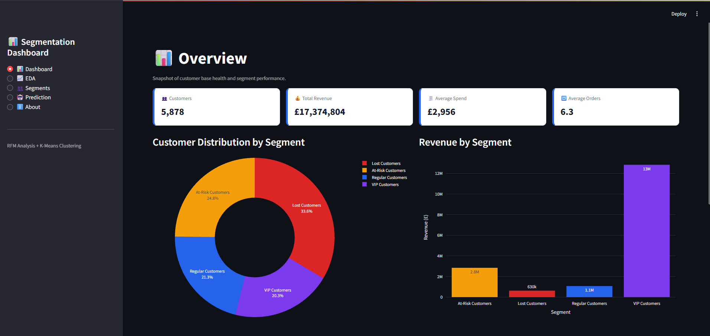
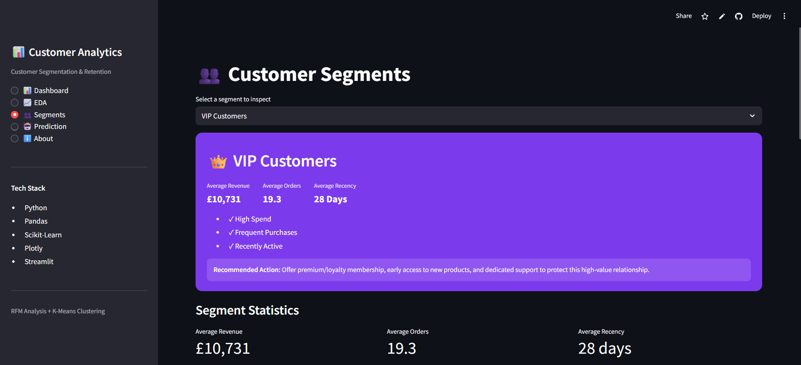
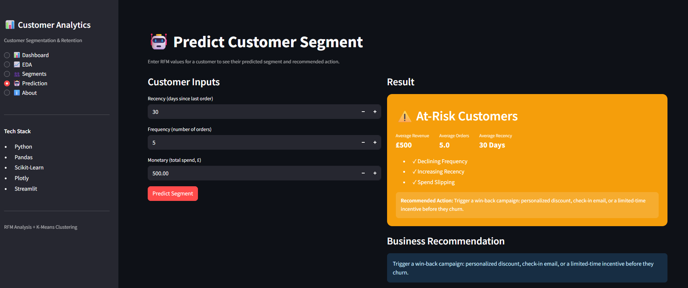

# 📊 Customer Segmentation & Retention Analysis


An end-to-end **Data Science** project that segments customers using **RFM Analysis** and **K-Means Clustering** to help businesses understand customer behavior, improve retention, and optimize marketing strategies.

---

# 🌐 Live Demo

**Streamlit App**

https://customer-segment-retention-analysis.streamlit.app/

---

# 📸 Dashboard Preview

## Dashboard Overview



## Customer Insights



## Prediction



---

# 📌 Business Problem

Retail businesses often spend the same marketing budget on every customer, even though customers have very different purchasing behaviors.

This project helps answer important business questions such as:

- Who are the most valuable customers?
- Which customers are likely to stop purchasing?
- Which customers deserve loyalty rewards?
- Which customers should receive retention campaigns?
- How can marketing resources be allocated more efficiently?

Using **RFM Analysis** and **K-Means Clustering**, customers are grouped into meaningful business segments that support data-driven decision making.

---

# 📂 Dataset

**Dataset:** Online Retail II

The dataset contains over **1 million retail transactions** from a UK-based online retailer.

### Main Features

- Invoice
- Customer ID
- Invoice Date
- Stock Code
- Product Description
- Quantity
- Price
- Country

---

# 🏗️ Project Architecture

```text
Online Retail II Dataset
            │
            ▼
      Data Cleaning
            │
            ▼
 Exploratory Data Analysis
            │
            ▼
 Feature Engineering (RFM)
            │
            ▼
 Log Transformation
            │
            ▼
 StandardScaler
            │
            ▼
     K-Means Clustering
            │
            ▼
 Customer Segmentation
            │
            ▼
 Retention Analysis
            │
            ▼
 Interactive Streamlit Dashboard
```

---

# ⚙️ Project Workflow

1. Data Collection
2. Data Cleaning
3. Exploratory Data Analysis
4. Feature Engineering
5. RFM Analysis
6. Log Transformation
7. Feature Scaling
8. K-Means Clustering
9. Customer Segmentation
10. Retention Analysis
11. Dashboard Development
12. Model Deployment

---

# 📁 Project Structure

```text
Customer/

│
├── .streamlit/
│   └── config.toml
│
├── app/
│   └── dashboard.py
│
├── data/
│   ├── online_retail_II.csv
│   └── customer_segments.csv
│
├── models/
│   ├── kmeans_model.pkl
│   └── scaler.pkl
│
├── notebooks/
│   ├── 01_Data_Cleaning.ipynb
│   ├── 02_EDA.ipynb
│   ├── 03_RFM_Analysis.ipynb
│   ├── 04_Customer_Segmentation.ipynb
│   └── 05_Dashboard.ipynb
│
├── screenshots/
│   ├── dashboard.png
│   ├── insights.png
│   └── prediction.png
│
├── README.md
├── requirements.txt
└── .gitignore
```

---

# 📊 Exploratory Data Analysis

The project includes detailed EDA to understand:

- Customer purchasing patterns
- Country-wise revenue
- Product popularity
- Monthly revenue trends
- Customer purchasing frequency
- Revenue distribution
- Business KPIs

---

# 🧠 Feature Engineering

Customer behavior was summarized using **RFM Analysis**.

### Recency

Days since the customer's last purchase.

### Frequency

Number of unique purchases made by the customer.

### Monetary

Total amount spent by the customer.

These three features were used as input for clustering.

---

# 🤖 Machine Learning

## Algorithm

- K-Means Clustering

## Data Preprocessing

- Missing value handling
- Duplicate removal
- Invalid transaction removal
- Log Transformation
- StandardScaler

## Model Selection

The optimal number of clusters was determined using:

- Elbow Method
- Silhouette Score

## Cluster → Segment Labeling

Cluster IDs produced by K-Means are arbitrary and can shift between runs or
after retraining. Rather than hardcoding a fixed mapping like
`{0: "Lost Customers", 1: "Regular Customers", ...}`, both the training
notebook and the dashboard compute the cluster → business-label mapping at
runtime from each cluster's RFM profile. This keeps segment labels correct
even if the underlying model is retrained on new data.

---

# 📈 Customer Segments

The model identifies four customer groups.

| Segment | Description |
|----------|-------------|
| 👑 VIP Customers | High spending, frequent purchases, recently active |
| 🙂 Regular Customers | Consistent customers with moderate spending |
| ⚠️ At-Risk Customers | Previously valuable customers becoming inactive |
| 💤 Lost Customers | Long inactive customers with low spending |

---

# 📌 Key Results

- Processed over **1 million retail transactions**.
- Engineered **RFM features** for customer-level analysis.
- Segmented **5,878 customers** into four meaningful business groups.
- Identified high-value customers for loyalty programs.
- Identified at-risk customers for targeted retention campaigns.
- Built an interactive dashboard for business users.
- Enabled real-time customer segment prediction.

---

# 📊 Dashboard Features

The Streamlit dashboard includes:

- 📈 Business KPIs
- 📋 Executive Summary
- 🌍 Revenue Analysis (with tabbed Revenue / Customers / Data views)
- 👥 Customer Distribution
- 📊 RFM Analytics
- 🏆 Top Customers per Segment
- 🔍 Customer Lookup
- 🤖 Customer Segment Prediction
- 📥 CSV Download

---

# 📈 Business Recommendations

| Customer Segment | Recommended Business Action |
|------------------|-----------------------------|
| 👑 VIP Customers | Offer premium memberships, exclusive rewards, and early access to products. |
| 🙂 Regular Customers | Encourage repeat purchases using loyalty programs and personalized recommendations. |
| ⚠️ At-Risk Customers | Launch personalized retention campaigns and limited-time offers. |
| 💤 Lost Customers | Use win-back campaigns with promotional discounts or reduce marketing spend if inactive for long periods. |

---

# 🛠 Tech Stack

### Programming

- Python

### Data Analysis

- Pandas
- NumPy

### Machine Learning

- Scikit-Learn

### Visualization

- Plotly
- Matplotlib
- Seaborn

### Dashboard

- Streamlit

### Model Persistence

- Joblib

---

# 💡 Skills Demonstrated

- Data Cleaning
- Exploratory Data Analysis
- Feature Engineering
- RFM Analysis
- Customer Segmentation
- K-Means Clustering
- Feature Scaling
- Business Analytics
- Dashboard Development
- Model Deployment

---

# ⚙️ Installation

Clone the repository

```bash
git clone https://github.com/dhruvjindal007/Customer_segmentation_retention_analysis.git
```

Move into the project

```bash
cd customer-segmentation-retention-analysis
```

Create a virtual environment

```bash
python -m venv .venv
```

Activate it

### Windows

```bash
.venv\Scripts\activate
```

### Linux / macOS

```bash
source .venv/bin/activate
```

Install dependencies

```bash
pip install -r requirements.txt
```

Run the dashboard

```bash
streamlit run app/dashboard.py
```

---

# 🚀 Future Improvements

- Customer Churn Prediction
- Customer Lifetime Value (CLV)
- Product Recommendation System
- Automated Model Retraining
- Cloud Deployment
- Real-Time Customer Monitoring

---

# 👨‍💻 Author

**Dhruv Jindal**

If you found this project useful, feel free to ⭐ the repository.